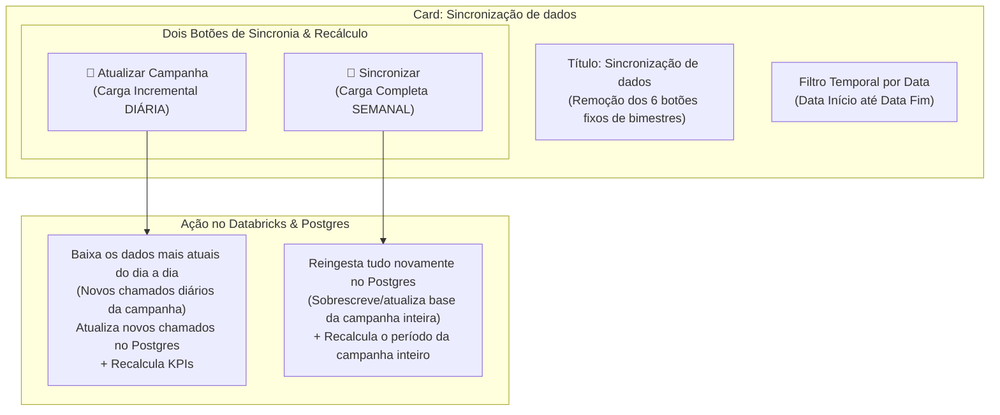
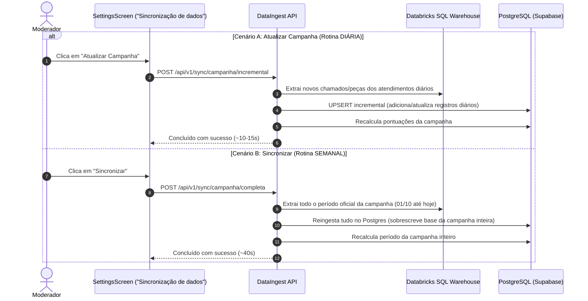

# 📋 Plano de Implementação: Sincronização de Dados & Motor de Campanha (Atualizado)

> **Origem da Demanda:** Sketch [`docs/Sketch/ingest.excalidraw`](file:///c:/Users/marci/Documents/Positivo/Projetos/DigitalTwin/docs/Sketch/ingest.excalidraw) + Comentários do Usuário  
> **Título Oficial do Card:** **"Sincronização de dados"**  
> **Periodicidade Oficial:** **Atualizar Campanha = Diária** | **Sincronizar = Semanal**  
> **Modo:** Multi-Agent Orchestration (Fase 1: Planejamento Revisado)  
> **Especialistas:** `@database-architect`, `@backend-specialist`, `@frontend-specialist`, `@test-engineer`  
> **Status:** ⏸️ **Aguardando Aprovação do Usuário para Início da Implementação**

---

## 1. 🔍 Alinhamento das Diretrizes do Usuário

Conforme os comentários registrados no relatório e no sketch `ingest.excalidraw`, o card e os botões terão as seguintes definições definitivas:

---

## 2. ⚖️ Matriz Comparativa Oficial: "Atualizar Campanha" vs. "Sincronizar"

Ambos os botões têm em comum: **baixam os dados mais atuais do Databricks e recalculam os KPIs oficiais**.  
A diferença essencial reside na **frequência e no volume de reprocessamento**:

| Característica | 🚀 Botão: `Atualizar Campanha` | 🔄 Botão: `Sincronizar` |
| :--- | :--- | :--- |
| **Tipo de Carga** | **Incremental (Diária)** | **Completa (Semanal)** |
| **Frequência de Uso** | **DIÁRIA** (rotina de acompanhamento diário do moderador) | **SEMANAL** (rotina semanal para consolidação e fechamentos) |
| **Escopo Temporal** | Dados mais recentes da campanha (últimos dias / D-1 até hoje) | **Período da campanha ativa inteiro** (`01/10/2026` até a data atual) |
| **Comportamento no Postgres** | Insere novos chamados atendidos no dia a dia e atualiza status recentes | **Injeta tudo novamente no Postgres**, sobrescrevendo e atualizando tudo o que já existe |
| **Recálculo de KPIs** | Recalcula os KPIs e notas da campanha com os novos atendimentos diários | **Recalcula novamente o período da campanha inteiro** de ponta a ponta |
| **Tempo Estimado** | Muito rápido (~10 a 15 segundos) | Processamento completo (~35 a 50 segundos) |

---

## 3. 🏗️ Arquitetura Técnica Detalhada

### 3.1 Frontend (`SettingsScreen.tsx` & `syncStore.ts`)

1. **Card Principal:**
   * Título ajustado: **`Sincronização de dados`** (com badge de conexão Databricks SQL Warehouse).
   * Subtítulo: *"Extrai dados de chamados, reincidências e peças diretamente do Datalake corporativo e atualiza os indicadores."*
2. **Eliminação dos Botões Fixos de Bimestres:**
   * Remoção definitiva da grade com os 6 botões (1º ao 6º Bimestre) e do toggle de abas.
   * Manutenção exclusiva dos seletores limpos de **Data Início** e **Data Fim**, com badge do intervalo dinâmico.
3. **Barra de Ações no Header (Lado a Lado):**
   * **Botão 1 — `Sincronizar` (Semanal):**
     * Ícone: `RefreshCw`
     * Ação: Dispara a carga completa da campanha inteira (ou do período selecionado nos inputs).
     * Tooltip: *"Rotina Semanal: Injeta tudo novamente no Postgres para o período da campanha inteira e recalcula todas as pontuações."*
   * **Botão 2 — `Atualizar Campanha` (Diária):**
     * Estilo: Variante neon/teal de destaque, ícone `BarChart3`.
     * Ação: Dispara a carga incremental dos dados mais recentes e recalcula os KPIs.
     * Tooltip: *"Rotina Diária: Carga incremental dos dados mais recentes + recálculo automático de KPIs."*
4. **Integração com `syncStore.ts`:**
   * Função `triggerIncrementalCampaignSync()` -> aciona `POST /api/v1/sync/campanha/incremental`
   * Função `triggerFullCampaignSync()` -> aciona `POST /api/v1/sync/campanha/completa`
   * Acompanhamento pelo widget flutuante e pela barra de progresso do card.

---

### 3.2 Backend (`DataIngest` / FastAPI)

Implementação de rotas dedicadas e claras no microserviço:

1. **Endpoint `POST /api/v1/sync/campanha/incremental` (`Atualizar Campanha` — Diária):**
   * Localiza a campanha ativa (`SELECT data_inicio, data_fim FROM tb_campanha WHERE ativa = true`).
   * Define janela incremental dos dados recentes (D-2 até a data atual).
   * Executa extração do Databricks via streaming PyArrow com `UPSERT` cirúrgico no Postgres em `chamados`, `pecas`, `reincidentes`, `tb_chamado` e `tb_encerrados_rrc`.
   * Dispara imediatamente `CalculoPontuacaoService.calcular_campanha_ativa()`.
   * Atualiza `sync_status_tracker` (0% a 100%).

2. **Endpoint `POST /api/v1/sync/campanha/completa` (`Sincronizar` — Semanal):**
   * Localiza a campanha ativa (`01/10/2026` até a data atual).
   * Realiza a reingestão de todo o período no Postgres:
     * Substituição limpa por janela (`DELETE WHERE ft BETWEEN inicio AND fim`) + inserção dos dados completos mais frescos do Databricks.
     * Atualização integral de `tb_chamado` e `tb_encerrados_rrc`.
     * Executa recálculo total das pontuações do período completo da campanha.
   * Atualiza `sync_status_tracker` (0% a 100%).

---

### 3.3 Banco de Dados & Performance (`@database-design`)

* **Preservação de Dados Históricos:**
  * O expurgo dos dados de testes (< 01/10/2026) já foi realizado e consolidado.
  * Ambas as rotas operam estritamente dentro da janela da **Campanha 11 (Outubro/2026)**, garantindo que o banco permaneça enxuto e rápido.
* **Idempotência Garantida:**
  * Ambos os métodos utilizam transações atômicas com `UPSERT` (`ON CONFLICT (chamado) DO UPDATE`), evitando duplicações independentemente de quantas vezes forem executados.
* **Índices de Apoio:**
  * Assegurar que as buscas e exclusões em `ft`, `data_fechamento` e `encerramento_rrc` utilizem os índices existentes para execução em milissegundos.

---

## 4. 👥 Equipe de Especialistas na Fase 2

Conforme a exigência de multi-agente do protocolo de orquestração:

| # | Agente Especialista | Área de Atuação | Responsabilidade na Implementação |
|---|---------------------|-----------------|-----------------------------------|
| 1 | `backend-specialist` | API & Microserviço DataIngest | Criar os endpoints `/sync/campanha/incremental` e `/sync/campanha/completa`, conectando ao `ETLService` e `CalculoPontuacaoService`. |
| 2 | `frontend-specialist` | UI / React / Tailwind | Atualizar o card para "Sincronização de dados", remover a grade de bimestres, implementar os dois botões com seus tooltips e estados de loading. |
| 3 | `database-architect` | PostgreSQL / Performance | Validar as queries de carga incremental e completa, testar locks e tempos de execução do recálculo. |
| 4 | `test-engineer` | Validação & QA | Executar testes funcionais, validar build (`tsc && vite build`) e rodar scripts de linting e segurança. |

---

## 5. 📅 Fluxo de Execução dos Dois Botões

---

## 6. ✅ Critérios de Aceite e Verificação

1. **Card "Sincronização de dados":**
   * Título alterado para **"Sincronização de dados"**.
   * Grade dos 6 botões de bimestres removida.
   * Seletor de data moderno e funcional.
2. **Botões no Header com Periodicidade Clara:**
   * Botão **`Atualizar Campanha`**: Rotina **DIÁRIA** (incremental rápido dos dados recentes + recálculo de KPIs).
   * Botão **`Sincronizar`**: Rotina **SEMANAL** (reingesta a campanha inteira no Postgres + recálculo total do período).
3. **Consistência do Banco:**
   * Zero duplicação de dados.
   * Total compatibilidade com a Campanha 11 de Outubro/2026.
4. **Build & Validação:**
   * Build do frontend (`npm run build`) validado com zero erros.
   * Verificação de lint e segurança aprovada.

---

## 7. ⏸️ CHECKPOINT DE APROVAÇÃO (Fase 1 ➔ Fase 2)

> [!IMPORTANT]
> O plano foi ajustado com a periodicidade exata:
> 1. O botão **`Atualizar Campanha`** é a **rotina DIÁRIA** (incremental rápido + recálculo de KPIs).
> 2. O botão **`Sincronizar`** é a **rotina SEMANAL** (reingestão completa da campanha inteira + recálculo total).

**Você aprova o plano atualizado para iniciarmos a implementação na Fase 2?**
- **Sim (S / Y):** Iniciamos imediatamente a codificação dos especialistas.
- **Não (N):** Aponte outros ajustes caso deseje.
